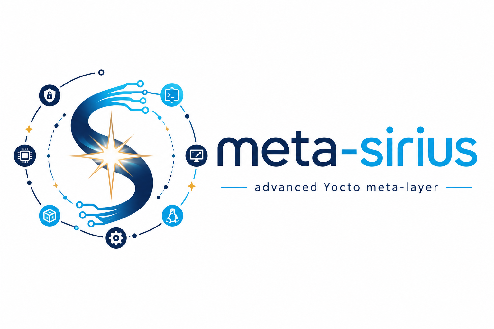

# meta-sirius

<p align="center">
  
</p>

<p align="center">
  <strong>Advanced Yocto meta-layer for custom embedded Linux images</strong>
</p>

<p align="center">
  <a href="https://github.com/prashantdivate/meta-sirius/actions">
    
  </a>
  <a href="https://github.com/prashantdivate/meta-sirius/blob/master/LICENSE">
    
  </a>
  <a href="https://github.com/prashantdivate/meta-sirius/stargazers">
    
  </a>
  <a href="https://github.com/prashantdivate/meta-sirius">
    
  </a>
</p>

---

## Overview

**meta-sirius** is a Yocto Project meta-layer for building, customizing, and experimenting with embedded Linux images.

The name **Sirius** comes from the brightest star in the night sky. In the same spirit, this layer aims to be a bright, practical, and feature-rich reference layer for Yocto-based embedded Linux development.

This layer demonstrates how to build custom images, add users, integrate applications, generate SD-card images, enable system services, extend graphics support, add security utilities, and improve developer workflow using linting and Git hooks.

It is useful for:

* Learning Yocto layer development
* Creating custom embedded Linux images
* Building WIC/SD-card images
* Adding boot-time applications
* Integrating system utilities and libraries
* Adding device hardening utilities such as Fail2ban
* Experimenting with Wayland, Weston, Waypipe, and RDP support
* Practicing Yocto recipe, image, class, and configuration customization

---

## Features

meta-sirius currently includes support for the following features:

### Image and filesystem features

* Custom Yocto image support
* Development image support through `sirius-dev-image`
* SD-card/WIC image support through `sirius-sd-card-image`
* Root filesystem customization
* OS version information added into the root filesystem
* Image-specific configuration support
* Build history support for development images

### System integration

* systemd support
* Extra user configuration support
* Root user password configuration example
* Boot-time userspace application support
* Helper scripts and custom utilities
* ShellHub integration support

### Security / Remote Access / Fleet Management features

* wolfSSL security/TLS library integration
* Fail2ban utility support
* Fail2ban SSH jail/configuration support
* Basic SSH brute-force protection example
* Security-focused recipe organization under `recipes-security/`
* ShellHub integration support
* ShellHub agent integration for secure reverse SSH access
* Zero-touch device registration using Yocto build-time configuration
* Remote access for devices behind NAT, firewalls, or cellular networks
* Systemd-managed `shellhub-agent` service

### Application and package examples

* Example C application recipe: `helloworld`
* fastfetch system information utility
* lolcat utility support
* curl customization support
* logrotate support
* cloud-utils-growpart support
* Custom helper package support

### Graphics and remote access

* Wayland/Weston customization
* Weston RDP support
* Weston fbdev backend support
* Weston launch support
* Waypipe support
* Remote desktop access examples using FreeRDP clients

### Developer workflow

* oelint integration
* Pre-commit hook support
* Commit message formatting hook
* Layer structure suitable for learning and experimentation

---

## Repository structure

```text
meta-sirius/
├── .github/
│   └── workflows/              # GitHub Actions workflow files
├── classes/                    # Custom BitBake classes
├── conf/                       # Layer configuration
├── docs/                       # features setup guides
├── recipes-connectivity/       # Connectivity related recipes/appends
├── recipes-core/               # Core image and system recipes
├── recipes-extended/           # Extended utilities and packages
├── recipes-graphics/           # Graphics, Wayland and Weston appends
├── recipes-kernel/             # Kernel related recipes/appends
├── recipes-misc/               # Miscellaneous helper recipes
├── recipes-support/            # Supporting packages
├── recipes-wolfssl/            # wolfSSL integration
├── scripts/                    # Developer workflow helper scripts
├── wic/                        # WIC image layout files
├── LICENSE
└── README.md
```
---

## Layer compatibility

The layer currently declares compatibility with the following Yocto releases:

| Yocto release | Status   |
| ------------- | -------- |
| zeus          | Declared |
| dunfell       | Declared |
| honister      | Declared |
| kirkstone     | Declared |

> Note: Compatibility should be updated only after validating the layer with newer Yocto releases.

Recommended future targets:

| Yocto release | Recommendation                       |
| ------------- | ------------------------------------ |
| kirkstone     | Keep as stable LTS baseline          |
| scarthgap     | Recommended modern LTS target        |
| walnascar     | Recommended future validation target |

---

## Dependencies

A typical Yocto/Poky setup is required.

Recommended base layers:

```text
poky/meta
poky/meta-poky
poky/meta-yocto-bsp
```

Depending on the selected recipes and image features, additional OpenEmbedded layers may be required:

```text
meta-openembedded/meta-oe
meta-openembedded/meta-python
meta-openembedded/meta-networking
meta-openembedded/meta-filesystems
```

Recommended tools on the host system:

```sh
sudo apt update
sudo apt install -y \
  gawk wget git diffstat unzip texinfo gcc build-essential chrpath socat cpio \
  python3 python3-pip python3-pexpect xz-utils debianutils iputils-ping \
  libegl1-mesa libsdl1.2-dev xterm file locales
```

> Package requirements can vary depending on your Linux distribution and Yocto release.

---

## Getting started

### 1. Clone the layer

```sh
git clone https://github.com/prashantdivate/meta-sirius.git
```

### 2. Add the layer to your Yocto build

From your Yocto build directory, run:

```sh
bitbake-layers add-layer /path/to/meta-sirius
```

Or manually add the layer path to `conf/bblayers.conf`:

```conf
BBLAYERS += "/path/to/meta-sirius"
```

Example:

```conf
BBLAYERS ?= " \
  /path/to/poky/meta \
  /path/to/poky/meta-poky \
  /path/to/poky/meta-yocto-bsp \
  /path/to/meta-openembedded/meta-oe \
  /path/to/meta-openembedded/meta-python \
  /path/to/meta-openembedded/meta-networking \
  /path/to/meta-sirius \
"
```

### 3. Set up the build environment

Example using Poky:

```sh
source oe-init-build-env build
```

Set your target machine and distro in `conf/local.conf`.

Example:

```conf
MACHINE ??= "qemux86-64"
DISTRO ?= "poky"
```

---

## Available images

### sirius-dev-image

Development-focused image with useful tools and packages for testing, debugging, and experimentation.

Build command:

```sh
bitbake sirius-dev-image
```

### sirius-sd-card-image

WIC-based SD-card image for deployable storage media.

Build command:

```sh
bitbake sirius-sd-card-image
```

Generated image artifacts are available under:

```text
tmp/deploy/images/<machine>/
```

Example:

```text
tmp/deploy/images/qemux86-64/
```

---

## Image contents

The Sirius images can include packages and components such as:

| Component              | Purpose                                                                  |
| ---------------------- | ------------------------------------------------------------------------ |
| `base-files`           | Base filesystem files                                                    |
| `busybox`              | Core embedded Linux utilities                                            |
| `helloworld`           | Example custom C application                                             |
| `wolfssl`              | Security/TLS library                                                     |
| `fail2ban`             | Intrusion prevention utility for blocking repeated failed login attempts |
| `fail2ban-ssh`         | SSH-specific Fail2ban jail/configuration support                         |
| `fastfetch`            | System information utility                                               |
| `lolcat`               | Terminal text color utility                                              |
| `curl`                 | Data transfer utility                                                    |
| `logrotate`            | Log rotation utility                                                     |
| `cloud-utils-growpart` | Partition resize/grow utility                                            |
| `helpers`              | Custom helper scripts                                                    |
| `shellhub`             | Remote device access/management support                                  |
| `systemd`              | Init system support                                                      |

---

## Documentation

Additional documentation is available under the `docs/` directory.

| Document                               | Description                      |
| -------------------------------------- | -------------------------------- |
| [`docs/fail2ban.md`](docs/fail2ban.md) | Fail2ban setup and usage guide   |
| [`docs/shellhub.md`](docs/shellhub.md) | ShellHub agent setup for secure reverse SSH and zero-touch IoT fleet onboarding |
| [`docs/wayland-rdp.md`](docs/wayland-rdp.md) | Wayland/Weston RDP remote access setup |

---

## Security: Fail2ban support

meta-sirius includes Fail2ban support under `recipes-security/`.

Fail2ban is useful for improving device security by monitoring authentication logs and banning IP addresses that repeatedly fail login attempts.

This layer includes:

```text
recipes-security/
├── fail2ban/
└── fail2ban-ssh/
```

The `fail2ban` recipe provides the utility, while `fail2ban-ssh` can be used for SSH-specific jail configuration.

For detailed setup and usage instructions, see:

```text
docs/fail2ban.md
```

Or open the guide directly:

[Fail2ban setup guide](docs/fail2ban.md)

---

## ShellHub remote access support

meta-sirius includes ShellHub agent integration for secure reverse SSH access to embedded Linux devices.

This is useful for:

* Remote field diagnostics
* IoT fleet management
* Devices behind NAT, firewalls, or cellular networks
* Zero-touch device onboarding
* Secure remote maintenance without public inbound SSH

The related layer support is available under:

```text
recipes-core/
└── shellhub/
```

For full setup instructions, Yocto configuration variables, systemd verification, device approval flow, troubleshooting, and reference material, see:

[ShellHub agent setup guide](docs/shellhub.md)

---

## Wayland, Weston and RDP support

meta-sirius includes support for remotely accessing Wayland-based applications using Weston screen sharing and the RDP backend.

This is useful for:

* Remotely viewing Wayland applications
* Debugging graphical applications
* Accessing GUI output from remote or headless boards
* Demonstrating embedded Linux graphical applications
* Testing Weston integration in Yocto images

The related layer support is available under:

```text
recipes-graphics/
├── wayland/
└── waypipe/
```

For full setup instructions, certificate generation, Weston configuration, host connection commands, troubleshooting steps, and reference material, see:

[Wayland RDP setup guide](docs/wayland-rdp.md)

## WIC and SD-card image support

The layer supports WIC image generation for SD-card deployment.

WIC layout files are stored under:

```text
wic/
```

The SD-card image recipe uses a WIC layout to generate deployable image artifacts.

Build the SD-card image:

```sh
bitbake sirius-sd-card-image
```

Check generated files:

```sh
ls tmp/deploy/images/<machine>/*.wic*
```

To flash the image to an SD card:

```sh
sudo bmaptool copy tmp/deploy/images/<machine>/<image-name>.wic.gz /dev/sdX
```

Or use `dd` carefully:

```sh
gzip -dc tmp/deploy/images/<machine>/<image-name>.wic.gz | sudo dd of=/dev/sdX bs=4M status=progress conv=fsync
```

> Replace `/dev/sdX` with the correct block device. Using the wrong device can erase data.

---

## Developer workflow

### oelint check script

To run the oelint helper script:

```sh
./scripts/oelint-check.sh
```

### Commit message formatting hook

To enable commit message checks or formatting:

```sh
cp scripts/commit-msg .git/hooks/commit-msg
chmod +x .git/hooks/commit-msg
```

These scripts help keep the layer cleaner and more consistent during development.

---

## Suggested validation commands

After adding the layer, validate that BitBake can detect it:

```sh
bitbake-layers show-layers
```

List available recipes:

```sh
bitbake-layers show-recipes | grep sirius
```

List available security recipes:

```sh
bitbake-layers show-recipes | grep fail2ban
```

List available images:

```sh
bitbake-layers show-recipes "*image*"
```

Run a parse check:

```sh
bitbake -p
```

Build the development image:

```sh
bitbake sirius-dev-image
```

Build the SD-card image:

```sh
bitbake sirius-sd-card-image
```

---

## Recommended CI checks

A good CI pipeline for this layer should validate:

```sh
bitbake -p
bitbake-layers show-layers
bitbake-layers show-recipes
oelint-adv .
```

---

## Roadmap

Planned and recommended improvements:

* Add support for newer Yocto releases
* Improve CI validation
* Add runtime image testing
* Add documentation for each major recipe
* Expand security documentation
* Add screenshots and boot logs
* Add generated image examples
* Add support matrix for machines and Yocto releases
* Improve security defaults for demo users and passwords
* Add release tags for tested Yocto versions
* Add changelog and versioning policy

---

## Recommended improvements for production usage

Before using this layer for production devices, review the following areas:

### Security

* Remove demo passwords
* Disable root password login
* Use SSH keys instead of default credentials
* Enable Fail2ban for SSH-exposed targets
* Review all installed packages
* Minimize image contents
* Enable secure update strategy
* Add SBOM generation if required
* Track CVEs for included packages

### Maintainability

* Split demo recipes from production recipes
* Add documentation per image
* Add comments to custom classes
* Add machine compatibility notes
* Add tested Yocto version matrix
* Add CI for parse and image build checks

### Reproducibility

* Pin compatible layer branches
* Document tested host OS versions
* Add locked dependency versions where needed
* Provide a clean quick-start path

---

## Contribution

Contributions are welcome.

You can help by:

* Opening issues
* Reporting build failures
* Improving recipes
* Adding support for newer Yocto releases
* Improving documentation
* Adding CI and test coverage
* Submitting pull requests

Recommended contribution flow:

```sh
git checkout -b feature/my-change
git commit -s
git push origin feature/my-change
```

Then open a pull request.

---

## License

This project is licensed under the MIT License.

See the [LICENSE](LICENSE) file for details.

---

## Author

Created and maintained by **Prashant Divate**.

GitHub: [@prashantdivate](https://github.com/prashantdivate)

